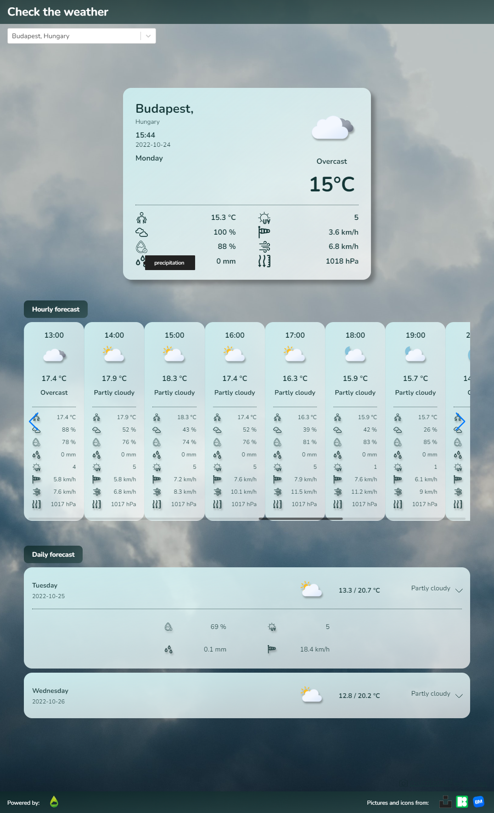

# My Weather Application

Find the running application via this link: [Weather App](https://my-weather-app-d0b5f.web.app/). 

This pet-project (bootstrapped with [Create React App](https://github.com/facebook/create-react-app)) was created to practice React.js.\
Opening the page you can search for many cities around the world with the help of autocomplete and check the current and the forecast weather of them powered by [WeatherAPI.com](https://www.weatherapi.com/).

## Usage

1. Clone the project

2. Install *dependencies* listed in package.json (in *weather-app* folder)
```
npm install
```

3. Add your own API key to the project\
\
Create a new *api* folder in *src* folder.\
In this new folder create *apiData.js*\
Add the followings to the new *apiData.js* file:
```
export const WEATHERAPI_URL = "https://api.weatherapi.com/v1";
export const WEATHERAPI_KEY = "yourOwnAPIKey";
```

4. Run the app in the development mode
```
npm start
```
Open [http://localhost:3000](http://localhost:3000) to view it in your browser.

## Preview

